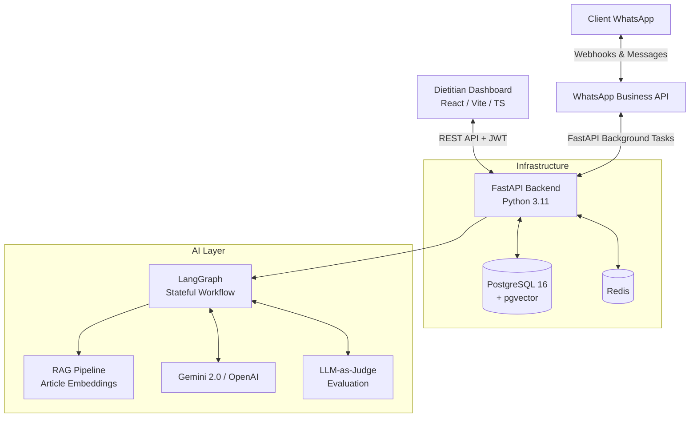

# 🥗 NutriPlan

**NutriPlan** is an AI-powered practice OS for Indian nutritionists. It empowers dietitians to manage clients via a comprehensive web dashboard, uses AI to draft highly personalized meal plans, and lets clients interact entirely through WhatsApp—eliminating the need for them to download yet another app.

This project was built to demonstrate full-stack product engineering, production-grade AI integration, and robust system design.

---

## 🏗️ Architecture

NutriPlan uses a monolithic, multi-tenant architecture designed for scale and maintainability without over-engineering.



### 🛠️ Tech Stack

| Layer | Technology |
|-------|-----------|
| **Backend** | FastAPI, Python 3.11, SQLAlchemy 2.0 (async), Alembic |
| **Frontend** | React 19, Vite, TypeScript, Vanilla CSS with design tokens |
| **Database** | PostgreSQL 16 + pgvector |
| **Cache** | Redis |
| **AI/ML** | LangChain → LangGraph, Google Gemini 2.0 Flash (primary), OpenAI (fallback) |
| **Messaging** | WhatsApp Business Cloud API |
| **Deployment** | Docker, Docker Compose, GitHub Actions CI/CD |

---

## 🧠 The AI Evolution Story

NutriPlan's AI architecture evolved intentionally as complexity grew — I started simple and added abstractions only when justified:

| Phase | Approach | Why |
|-------|----------|-----|
| **Phase 4 (MVP)** | Direct Gemini API calls → structured JSON → rule-based validation | Fast to ship, free tier, minimal dependencies |
| **Phase 9** | LangChain + LangSmith tracing + RAG (pgvector) | Needed composable chains for article Q&A on WhatsApp; wanted observability |
| **Phase 10** | LangGraph multi-step stateful workflow | Single-shot plan generation was unreliable — needed validate → retry cycles |

The LangGraph workflow follows this graph:

```
Parse Profile → Retrieve Context (RAG) → Generate Plan → Validate (Allergens/Macros) → Retry (if fail) → Format Output
```

An **LLM-as-judge** pipeline evaluates plan practicality and cultural fit post-generation.

> **Interview note:** This evolution was deliberate. I can explain *why* each layer was added, not just *how*.

---

## 🔒 Security & Engineering Decisions

### Multi-Tenant Isolation
Every database query on tenant-scoped tables includes a `dietitian_id` filter. A dietitian can never see another dietitian's clients, plans, or articles. This is enforced at the service layer, not just the API layer.

### Authentication & Encryption
- JWT access tokens (60 min) + refresh token rotation with SHA-256 hashing
- Token family tracking: if a revoked refresh token is reused, the entire family is revoked (theft detection)
- Fernet (AES-128-CBC) encryption at rest for sensitive health data and WhatsApp credentials

### Production Config Validation
The app uses a `model_validator` to fail fast on startup if production config is insecure:
- Missing or placeholder `JWT_SECRET` / `ENCRYPTION_KEY`
- `CORS_ORIGINS` containing `*` or `localhost`
- Default database credentials

### WhatsApp Webhook Resilience
Meta requires a `200 OK` within 5 seconds. NutriPlan acknowledges immediately and processes messages via `BackgroundTasks` — never blocks the webhook response.

### Rate Limiting
Custom fixed-window rate limiter protects auth and public endpoints. Currently in-memory (per-worker); production would use Redis-backed limits.

> **Known tradeoff:** Refresh tokens are stored in `localStorage`, not httpOnly cookies. For a portfolio demo this is acceptable; for production with real health data, I'd migrate to secure cookies.

---

## 📁 Project Structure

```
nutriplan/
├── backend/
│   ├── app/
│   │   ├── main.py              # FastAPI app + middleware
│   │   ├── config.py            # Pydantic settings + production validation
│   │   ├── database.py          # Async SQLAlchemy engine + session
│   │   ├── dependencies.py      # Auth dependency (get_current_dietitian)
│   │   ├── core/                # Logger, rate limiter, encryption
│   │   ├── models/              # 15 SQLAlchemy models
│   │   ├── schemas/             # Pydantic v2 request/response schemas
│   │   ├── routers/v1/          # Versioned API routes (/api/v1/*)
│   │   ├── services/            # Business logic (tenant-scoped)
│   │   ├── ai/                  # Gemini/OpenAI clients, embeddings, prompts
│   │   └── whatsapp/            # Message formatter, intent classification
│   ├── tests/                   # 142 pytest tests (SQLite local, Postgres CI)
│   ├── alembic/                 # Database migrations
│   └── .env.example             # All config vars with docs
├── frontend/
│   ├── src/
│   │   ├── pages/               # Dashboard, Clients, Plans, Articles, etc.
│   │   ├── components/          # Reusable UI (PlanEditor, FoodSearch, etc.)
│   │   ├── contexts/            # Auth, Theme providers
│   │   ├── api/                 # HTTP client with token refresh
│   │   └── hooks/               # Custom React hooks
│   └── public/
├── docs/                        # PRD, technical spec, implementation plan
├── .github/workflows/ci.yml     # Lint → Test → Build → Docker
└── docker-compose.yml           # Postgres + backend + frontend
```

---

## 🚀 Quick Start

### Prerequisites
- Docker & Docker Compose
- (Optional) Node.js 20+, Python 3.11+ for local dev without Docker

### 1. Clone & configure

```bash
git clone https://github.com/NeeshamKalia/nutriplan.git
cd nutriplan
cp backend/.env.example backend/.env
# Edit backend/.env — at minimum set JWT_SECRET and GEMINI_API_KEY
```

### 2. Start the stack

```bash
docker-compose up -d
```

### 3. Run database migrations

```bash
cd backend
alembic upgrade head
```

### 4. Access the app

| Service | URL |
|---------|-----|
| Dietitian Dashboard | http://localhost:5173 |
| API Swagger Docs | http://localhost:8000/docs |
| Health Check | http://localhost:8000/health |

### 5. Run tests

```bash
# Backend (142 tests, uses SQLite locally)
cd backend && pytest tests/ -v

# Frontend (11 tests)
cd frontend && npm test -- --run
```

---

## 🧪 CI/CD

GitHub Actions runs on every push to `main`:

1. **Backend:** ruff lint → pytest (against Postgres service container) → pass/fail
2. **Frontend:** TypeScript type check → Vitest → Vite production build
3. **Docker:** Build backend + frontend images (main branch only)

---

## 📝 License

This is a personal portfolio project. Not licensed for commercial use.

---

*Built by [Neesham Kalia](https://github.com/NeeshamKalia) — backend engineer passionate about AI-powered products.*
