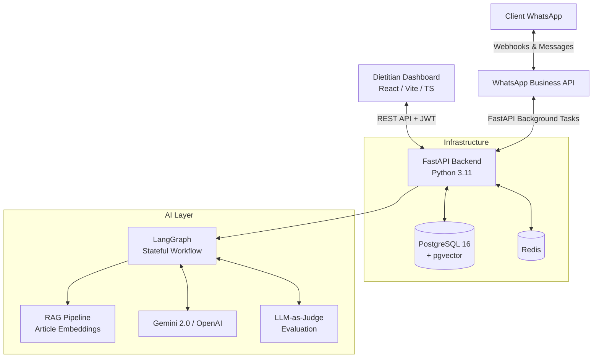

# 🥗 NutriPlan

**NutriPlan** is an AI-powered practice OS for Indian nutritionists. It empowers dietitians to manage clients via a comprehensive web dashboard, uses AI to draft highly personalized meal plans, and lets clients interact entirely through WhatsApp—eliminating the need for them to download yet another app.

This project was built to demonstrate full-stack product engineering, production-grade AI integration, and robust system design.

---

## 🏗️ Architecture

NutriPlan uses a monolithic, multi-tenant architecture designed for scale and maintainability without over-engineering.



### 🛠️ Tech Stack
- **Backend:** FastAPI, Python 3.11, SQLAlchemy 2.0, Alembic
- **Frontend:** React 19, Vite, TypeScript, Vanilla CSS (Design Tokens)
- **Database & Cache:** PostgreSQL 16 (with pgvector), Redis
- **AI/ML:** LangChain, LangGraph, Google Gemini 2.0 Flash (primary), OpenAI (fallback)
- **Messaging:** WhatsApp Business Cloud API
- **Deployment:** Docker, Docker Compose, GitHub Actions CI/CD

---

## 🧠 The AI Evolution Story

NutriPlan’s AI architecture evolved organically as the product’s complexity grew, avoiding premature optimization:

1. **MVP (Direct API Calls):**
   *Started with direct Gemini API calls passing a simple prompt and enforcing structured JSON output. This was fast and cost-effective for basic plan drafting.*
2. **Adding RAG (LangChain):**
   *As dietitians wrote articles, we needed a way for clients to ask questions on WhatsApp and get grounded answers. We migrated the AI layer to LangChain to easily integrate vector search (`pgvector`) and add LangSmith observability.*
3. **Multi-Step Generation (LangGraph):**
   *Meal plans are complex. Generating a perfect 7-day plan in one shot proved unreliable. We introduced **LangGraph** to create a stateful, cyclical workflow:*
   *`Parse Profile → Retrieve Context → Generate Plan → Validate (Allergens/Macros) → Retry (if validation fails) → Format Output`*
4. **Evaluation & Polish:**
   *Added an LLM-as-judge pipeline to continuously evaluate plan practicality and cultural fit.*

---

## 🔒 Key Engineering Features

- **Multi-Tenant Isolation:** Every single database query on client data is strictly scoped with a `dietitian_id` filter. Cross-tenant data leakage is structurally prevented.
- **Symmetric Encryption at Rest:** Sensitive client health data (medical conditions, allergies) and WhatsApp integration tokens are encrypted in the database using Fernet (AES-128-CBC).
- **Fixed-Window Rate Limiting:** Custom, lightweight in-memory rate limiter protects authentication and public intake endpoints from brute-force and spam.
- **Resilient Webhooks:** Meta requires a `200 OK` response within 5 seconds for WhatsApp webhooks. NutriPlan acknowledges immediately and processes incoming messages asynchronously via `FastAPI BackgroundTasks`.
- **Fault-Tolerant CI/CD:** Automated pipeline tests the application against a real PostgreSQL service container, builds Docker images, and ensures type-safety across the monorepo.

---

## 🚀 Quick Start (Local Development)

You can run the entire NutriPlan stack locally using Docker.

1. **Clone the repository:**
   ```bash
   git clone https://github.com/NeeshamKalia/nutriplan.git
   cd nutriplan
   ```

2. **Set up your environment variables:**
   Create a `.env` file in the `backend/` directory based on the configuration defined in `backend/app/config.py`. You will need API keys for Gemini (free tier works) and WhatsApp Business API.

3. **Spin up the stack:**
   ```bash
   docker-compose up -d
   ```

4. **Access the Application:**
   - **Backend API & Swagger Docs:** `http://localhost:8000/docs`
   - **Dietitian Dashboard (Frontend):** `http://localhost:5173`

*(Note: The frontend runs via the Vite dev server locally. In production, it is served via a multi-stage Nginx Docker image.)*
