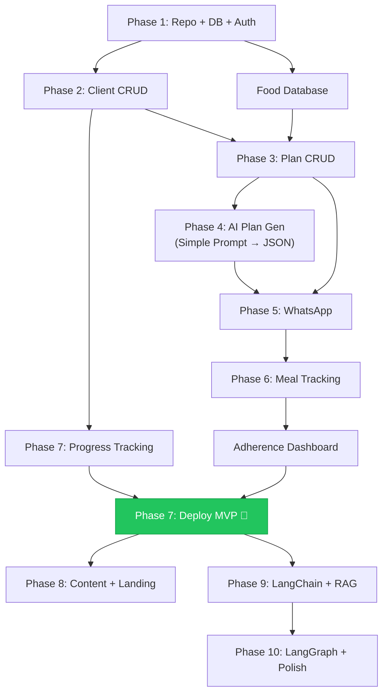

# NutriPlan — Implementation Plan (v2)

**Version:** 2.0  
**Last Updated:** 2026-06-13  
**Companion:** [PRD](./prd.md) | [Technical Spec](./technical_spec.md)

> [!IMPORTANT]
> **Build philosophy: Working software at every phase.** Each phase produces something demo-able. You should be able to stop after Phase 7 and still have the strongest project on any Mohali/Chandigarh resume.

> [!CAUTION]
> **MVP = Phases 1-7.** Everything after Phase 7 is enhancement. Do NOT start Phase 8+ until Phase 7 is deployed, live, and tested. Your roadmap's #1 rule applies: "Don't over-engineer NutriPlan."

---

## Phase Map

| Phase | What | Result After This Phase | Est. |
|---|---|---|---|
| **1** | Repo + DB + Auth | Dietitian can register and log in | 4h |
| **2** | Client CRUD | Dietitian can manage clients with health profiles | 3h |
| **3** | Meal Plan CRUD (manual) | Dietitian can create/edit meal plans by hand | 3h |
| **4** | AI Meal Plan Generation | AI drafts structured plans from client profile (simple prompt → JSON) | 4h |
| **5** | WhatsApp Integration | Plans delivered via WhatsApp, clients can use basic commands | 5h |
| **6** | Meal Tracking | Clients track meals via WhatsApp, dietitian sees adherence | 3h |
| **7** | Progress Tracking | Weight/measurement history with charts | 2h |
| **🏁 MVP COMPLETE — DEPLOY HERE** | | |
| **8** | Content & Landing Page | Articles, blog, branded landing page, SEO | 4h |
| **9** | LangChain + RAG | Migrate AI to LangChain, add article-based Q&A | 3h |
| **10** | LangGraph + Polish | Multi-step agent, protocols, Redis caching, evaluation pipeline | 5h |

---

## Evolution Story (This Is What Interviewers Want to Hear)

```
Phase 4:  "I started with Gemini's free tier — simple prompt → structured JSON. Zero cost during development."
Phase 9:  "I hit limitations — no composability, no tracing. So I migrated to LangChain."
Phase 10: "The plan generation needed multi-step validation, so I introduced LangGraph
           for the stateful workflow: parse → retrieve → generate → validate → format."
```

This narrative is **much stronger** than "I used LangGraph from day 1" — it shows engineering judgment.

---

## Phase 1: Foundation (Week 1 — Saturday/Sunday)

### TASK-101: Repository & Project Scaffolding
**Priority:** P0 | **Est:** 1h | **Deps:** None

**Description:**  
Initialize the NutriPlan monorepo with backend (FastAPI) and frontend (React/Vite/TS).

**Acceptance Criteria:**
- [ ] Git repo initialized with `.gitignore` (Python + Node)
- [ ] `backend/` — FastAPI project with `requirements.txt`:
  - `fastapi`, `uvicorn[standard]`, `sqlalchemy[asyncio]`, `asyncpg`, `alembic`
  - `pydantic[email]`, `pydantic-settings`, `python-jose[cryptography]`, `passlib[bcrypt]`
  - `httpx`, `python-multipart`
  - **No LangChain, no LangGraph, no Redis** (yet)
- [ ] `frontend/` — React + Vite + TypeScript (`npx -y create-vite@latest ./ --template react-ts`)
- [ ] `docker-compose.yml` with services: **postgres only** (16 + pgvector), backend, frontend
  - No Redis yet. No Celery. Keep it simple
- [ ] `backend/app/main.py` — FastAPI app with `GET /health` → `{"status": "ok"}`, logging middleware (request_id, correlation_id)
- [ ] `backend/app/config.py` — Pydantic BaseSettings (DATABASE_URL, JWT_SECRET, OPENAI_API_KEY, WHATSAPP_*, LOG_LEVEL)
- [ ] `backend/app/core/logger.py` — Structured JSON logging with `contextvars` (request_id, user_id, correlation_id)
- [ ] `backend/app/routers/v1/` — Versioned router directory (empty for now, auth goes here in TASK-103)
- [ ] `README.md` — project title, description, setup instructions
- [ ] Commit: `feat: initialize nutriplan monorepo`

**Key files:**
```
nutriplan/
├── docker-compose.yml
├── .gitignore
├── README.md
├── backend/
│   ├── requirements.txt
│   ├── app/
│   │   ├── __init__.py
│   │   ├── main.py
│   │   ├── config.py
│   │   ├── database.py
│   │   ├── core/
│   │   │   └── logger.py        # Structured JSON logging + context vars (request_id, user_id, correlation_id)
│   │   └── routers/
│   │       └── v1/              # Versioned API routes (/api/v1/*)
│   └── tests/
└── frontend/  (Vite scaffold)
```

---

### TASK-102: Database Schema & Models
**Priority:** P0 | **Est:** 1.5h | **Deps:** TASK-101

**Description:**  
Set up PostgreSQL + Alembic + all SQLAlchemy models.

**Acceptance Criteria:**
- [ ] `backend/app/database.py` — async SQLAlchemy engine + session
- [ ] Alembic configured (`alembic init`, `alembic.ini` pointing to DATABASE_URL)
- [ ] All models created (see tech spec Section 3.2):
  - `dietitians`, `refresh_tokens`, `clients`, `meal_plans`, `meal_plan_days`, `meal_plan_items`
  - `meal_plan_validations`, `meal_logs`, `whatsapp_messages`
  - `protocols`, `articles`, `article_embeddings`, `food_items`
  - `audit_logs` — tracks login, client_created, plan_generated, plan_approved events
  - **`progress_logs`** (see below)
- [ ] pgvector extension enabled
- [ ] Initial migration generated and applies cleanly
- [ ] `docker-compose up` → postgres starts → migration runs → tables exist

**NEW TABLE — Progress Tracking:**
```sql
CREATE TABLE progress_logs (
    id UUID PRIMARY KEY DEFAULT uuid_generate_v4(),
    client_id UUID NOT NULL REFERENCES clients(id) ON DELETE CASCADE,
    log_date DATE NOT NULL,
    weight_kg DECIMAL(5,1),
    waist_cm DECIMAL(5,1),
    hip_cm DECIMAL(5,1),
    chest_cm DECIMAL(5,1),
    notes TEXT,                          -- "Feeling more energetic", "Slept badly"
    logged_via VARCHAR(20) DEFAULT 'dashboard',  -- 'dashboard', 'whatsapp'
    created_at TIMESTAMPTZ DEFAULT NOW(),
    UNIQUE(client_id, log_date)
);
CREATE INDEX idx_progress_logs_client ON progress_logs(client_id, log_date);
```

---

### TASK-103: Authentication System
**Priority:** P0 | **Est:** 1.5h | **Deps:** TASK-102

**Description:**  
Dietitian registration, login, JWT management.

**Acceptance Criteria:**
- [ ] `backend/app/routers/v1/auth.py` — register, login, refresh, logout, me
- [ ] `backend/app/services/auth_service.py` — hash password, verify, create tokens, **store refresh tokens in `refresh_tokens` table (SHA-256 hashed, single-use rotation)**
- [ ] `backend/app/utils/security.py` — JWT encode/decode, bcrypt
- [ ] `backend/app/dependencies.py` — `get_current_dietitian` (FastAPI Depends)
- [ ] `backend/app/schemas/auth.py` — Pydantic request/response schemas
- [ ] Refresh token rotation: on `/auth/refresh`, revoke old token, issue new pair, link via `replaced_by`
- [ ] Logout: revoke refresh token (`revoked_at` set)
- [ ] Audit log entries created on: login, register
- [ ] Slug auto-generated from name (e.g., "Dr. Neha Sharma" → "dr-neha-sharma")
- [ ] Tests: `test_auth.py` — register, login, refresh rotation, logout, invalid creds, protected route
- [ ] Commit: `feat: add dietitian auth with JWT + refresh token rotation`

**After Phase 1:** Dietitian can register and log in. API returns JWT. Protected routes work.

---

## Phase 2: Client Management (Week 1 — Monday/Tuesday)

### TASK-201: Client CRUD API
**Priority:** P0 | **Est:** 1.5h | **Deps:** TASK-103

**Description:**  
Full client management with health profiles.

**Acceptance Criteria:**
- [ ] `backend/app/routers/v1/clients.py` — list, create, get, update, archive
- [ ] `backend/app/schemas/client.py` — Pydantic schemas
- [ ] All routes filter by `dietitian_id` (multi-tenant isolation)
- [ ] `GET /api/v1/clients` — list with pagination, search by name
- [ ] `POST /api/v1/clients` — full health profile (conditions, allergies, preferences, budget, goals)
- [ ] `GET /api/v1/clients/:id` — full profile
- [ ] `PUT /api/v1/clients/:id` — update
- [ ] `DELETE /api/v1/clients/:id` — soft delete (status='archived', archived_at=now())
- [ ] Unique: same WhatsApp number can't be added twice by same dietitian
- [ ] Tests: CRUD + multi-tenant isolation
- [ ] Commit: `feat: add client CRUD with health profiles`

---

### TASK-202: Frontend — Shell & Auth Pages
**Priority:** P0 | **Est:** 1.5h | **Deps:** TASK-103

**Description:**  
Design system, layout, auth pages.

**Acceptance Criteria:**
- [ ] `frontend/src/index.css` — design tokens (health/wellness palette, Inter font, dark mode vars)
- [ ] Layout: `Sidebar.tsx`, `TopBar.tsx`, `MainLayout.tsx`
- [ ] UI components: `Button`, `Input`, `Card`, `Badge`, `Modal`, `LoadingSpinner`
- [ ] `LoginPage.tsx`, `RegisterPage.tsx`
- [ ] `AuthContext.tsx` — login/logout/register state
- [ ] `api/client.ts` — fetch wrapper with JWT injection
- [ ] React Router setup with protected routes
- [ ] Premium aesthetic — modern health tech SaaS look
- [ ] Commit: `feat: add dashboard shell with auth`

---

### TASK-203: Frontend — Clients Pages
**Priority:** P0 | **Est:** 1.5h | **Deps:** TASK-201, TASK-202

**Description:**  
Client list and detail pages.

**Acceptance Criteria:**
- [ ] `ClientsPage.tsx` — client list (cards/table), search, "Add Client" button
- [ ] `ClientDetailPage.tsx` — full profile view/edit, tabbed (Profile | Plans | Progress)
- [ ] Add Client form — all health profile fields in organized sections
- [ ] Status badges (active, paused, needs attention)
- [ ] Commit: `feat: add client management UI`

**After Phase 2:** Full client management works. Dietitian can add clients with health profiles.

---

## Phase 3: Meal Plan CRUD (Week 2)

### TASK-301: Meal Plan Manual CRUD API
**Priority:** P0 | **Est:** 1.5h | **Deps:** TASK-201

**Description:**  
CRUD for meal plans WITHOUT AI. Dietitian can manually create/edit plans.

**Acceptance Criteria:**
- [ ] `backend/app/routers/plans.py`
- [ ] `backend/app/schemas/meal_plan.py`
- [ ] `POST /api/v1/clients/:id/plans` — create plan with days and items (manual entry)
- [ ] `GET /api/v1/clients/:id/plans` — list plans for client
- [ ] `GET /api/v1/plans/:id` — full plan with days/items
- [ ] `PUT /api/v1/plans/:id` — edit (swap items, change portions)
- [ ] `POST /api/v1/plans/:id/approve` — set status='approved', set approved_at
- [ ] Nutritional totals auto-calculated from items
- [ ] Commit: `feat: add meal plan CRUD`

> [!NOTE]
> Why manual CRUD first? Because the plan editor UI needs to work regardless of whether AI or human created the plan. Build the container before the content generator.

---

### TASK-302: Indian Food Database
**Priority:** P0 | **Est:** 2h | **Deps:** TASK-102

**Description:**  
Seed 200+ Indian food items.

**Acceptance Criteria:**
- [ ] `backend/seed/food_items.json` — 200-300 items with nutritional data (**cap at ~250 for MVP — the AI value comes from personalization + workflow, not a massive food DB**)
- [ ] Categories: grains, lentils, vegetables (30+), fruits (20+), dairy, proteins, snacks, beverages, condiments
- [ ] Each item: name, name_hindi, category, calories/100g, protein, carbs, fat, fiber, serving size, is_veg, allergens, cost/kg
- [ ] `GET /api/v1/foods?q=paneer` → search
- [ ] `GET /api/v1/foods?category=lentil` → filter
- [ ] Seed script: `python -m app.seed.load_foods`
- [ ] Commit: `feat: add Indian food database with 200+ items`

---

### TASK-303: Frontend — Plan Editor
**Priority:** P0 | **Est:** 2.5h | **Deps:** TASK-301, TASK-302, TASK-203

**Description:**  
The plan review/edit interface — the core workflow screen.

**Acceptance Criteria:**
- [ ] `PlanEditorPage.tsx`:
  - 7-day view (tabs or scroll)
  - 5 meal slots per day with items
  - Each item: food name, portion, calories, macros
  - Daily totals, overall plan summary
- [ ] Inline editing: click to edit, food search modal (searches food_items DB)
- [ ] "Approve & Send" button (WhatsApp delivery placeholder for now)
- [ ] Loading state for AI generation (will connect in Phase 4)
- [ ] Visual: clean data table, color-coded macros
- [ ] Commit: `feat: add plan editor UI`

**After Phase 3:** Dietitian can manually create, edit, and approve meal plans. The full data model works.

---

## Phase 4: AI Plan Generation (Week 2-3)

### TASK-401: Simple AI Plan Generator
**Priority:** P0 | **Est:** 2.5h | **Deps:** TASK-301, TASK-302

**Description:**  
AI generates meal plans using **simple prompt → Gemini API → structured JSON**. No LangChain. No LangGraph.

**Acceptance Criteria:**
- [ ] `backend/app/ai/plan_generator.py`:
  - Function: `generate_meal_plan(client: Client, food_items: list, custom_instructions: str | None) → MealPlan`
  - Builds a detailed prompt from client profile (conditions, allergies, preferences, budget, goals)
  - Calls Gemini API directly (`google-genai` package, not LangChain)
  - Uses `response_mime_type="application/json"` for structured output
  - Parses JSON response into `MealPlan` Pydantic model
  - Validates the JSON matches expected schema
  - Fallback: retry with OpenAI if Gemini fails
- [ ] `backend/app/ai/prompts/plan_generation.py`:
  - System prompt template
  - Client profile formatting function
  - JSON output schema definition
- [ ] `POST /api/v1/clients/:id/plans/generate` → calls generator → saves plan → returns plan
- [ ] Generation metadata tracked: model, tokens, cost, duration_ms
- [ ] Error handling: retry once on malformed JSON, return error if still fails
- [ ] Commit: `feat: add AI meal plan generation (simple prompt + structured output)`

**The prompt should produce:**
```json
{
  "days": [
    {
      "day_number": 1,
      "day_label": "Monday",
      "meals": [
        {
          "meal_type": "breakfast",
          "items": [
            {
              "food_name": "Moong dal cheela",
              "food_name_hindi": "मूंग दाल चीला",
              "portion_description": "2 medium pieces",
              "portion_grams": 150,
              "calories": 180,
              "protein_g": 12,
              "carbs_g": 22,
              "fat_g": 4,
              "fiber_g": 3,
              "preparation_notes": "Minimal oil, serve with green chutney"
            }
          ]
        }
      ]
    }
  ]
}
```

---

### TASK-402: Plan Validation (Simple)
**Priority:** P1 | **Est:** 1h | **Deps:** TASK-401

**Description:**  
Basic validation checks on generated plans. No LLM-as-judge yet — just rule-based checks.

**Acceptance Criteria:**
- [ ] `backend/app/ai/plan_validator.py`:
  - `check_allergens(plan, allergies: list[str]) → ValidationResult`
  - `check_calorie_range(plan, target: int, tolerance: float = 0.1) → ValidationResult`
  - `check_dietary_type(plan, dietary_type: str) → ValidationResult` (no meat for veg, etc.)
- [ ] Validations run after generation, results stored in `meal_plan_validations`
- [ ] Plan editor shows validation results (pass/fail badges)
- [ ] If allergen check fails → warning banner on plan editor
- [ ] Tests: `test_plan_validator.py` — comprehensive cases
- [ ] Commit: `feat: add rule-based plan validation`

---

### TASK-403: Connect AI to Plan Editor UI
**Priority:** P0 | **Est:** 1h | **Deps:** TASK-401, TASK-303

**Description:**  
Wire the "Generate Plan" button in the UI to the AI endpoint.

**Acceptance Criteria:**
- [ ] "Generate Plan" button on `ClientDetailPage.tsx` → calls generate API
- [ ] Loading state with animation: "Generating your personalized plan..."
- [ ] Generated plan opens in `PlanEditorPage.tsx` for review
- [ ] "Regenerate" button → optional custom instructions textarea → re-calls generate
- [ ] Validation results shown in sidebar/panel
- [ ] Commit: `feat: connect AI plan generation to UI`

**After Phase 4:** Dietitian clicks "Generate Plan" → AI creates a structured 7-day meal plan → dietitian reviews and edits → approves. Core AI workflow works.

---

## Phase 5: WhatsApp Integration (Week 3-4)

### TASK-501: WhatsApp Webhook & Send Service
**Priority:** P0 | **Est:** 2h | **Deps:** TASK-102

**Description:**  
Set up WhatsApp Business Cloud API — receive and send messages.

**Acceptance Criteria:**
- [ ] `backend/app/routers/webhook.py`:
  - `GET /webhook/whatsapp` — verification challenge (return hub.challenge)
  - `POST /webhook/whatsapp` — receive messages, verify `X-Hub-Signature-256`, return 200 immediately
  - Background processing via `FastAPI BackgroundTasks`
- [ ] `backend/app/services/whatsapp_service.py`:
  - `send_text_message(to_number, body)` — send plain text via Meta Graph API
  - `send_template_message(to_number, template_name, params)` — send template
- [ ] `backend/app/whatsapp/message_formatter.py`:
  - `format_daily_plan(plan_day)` → emoji-formatted meal list
  - `format_grocery_list(plan)` → aggregated ingredient list
- [ ] All messages logged to `whatsapp_messages` table
- [ ] Client identified by phone number lookup
- [ ] Tests: `test_webhook.py` — verification, valid message, invalid signature
- [ ] Commit: `feat: add WhatsApp webhook and send service`

---

### TASK-502: Intent Classification & Command Handlers
**Priority:** P0 | **Est:** 2h | **Deps:** TASK-501, TASK-301

**Description:**  
Classify incoming messages and handle basic commands.

**Acceptance Criteria:**
- [ ] `backend/app/whatsapp/intent_classifier.py` — rule-based:
  - `today/aaj` → command_today
  - `done/✅` → command_done
  - `grocery/list` → command_grocery
  - `help/?` → command_help
  - `swap/replace/I don't have` → command_swap
  - Fallback → question/unknown
- [ ] Handlers:
  - `handlers/today.py` — fetch active plan → send today's meals
  - `handlers/help.py` — send command list
  - `handlers/grocery.py` — aggregate weekly ingredients → send list
- [ ] Unknown messages → "I didn't understand. Send HELP for commands!"
- [ ] Tests: `test_intent_classifier.py`
- [ ] Commit: `feat: add WhatsApp intent classification and basic commands`

---

### TASK-503: Plan Delivery via WhatsApp
**Priority:** P0 | **Est:** 1h | **Deps:** TASK-501, TASK-301

**Description:**  
When dietitian approves a plan, deliver to client via WhatsApp.

**Acceptance Criteria:**
- [ ] `POST /api/v1/plans/:id/approve` now also:
  1. Formats plan summary
  2. Sends WhatsApp template message ("Your plan is ready!")
  3. Sends Day 1 detailed meals as follow-up text
  4. Updates plan status to 'delivered'
- [ ] If WhatsApp fails → log error, keep status='approved', allow retry
- [ ] Frontend "Approve & Send" button triggers this
- [ ] Commit: `feat: deliver approved plans via WhatsApp`

**After Phase 5:** Full loop works — dietitian generates plan → reviews → approves → client receives on WhatsApp → client can check TODAY, GROCERY, HELP.

---

## Phase 6: Meal Tracking (Week 4)

### TASK-601: DONE & Deviation Handlers
**Priority:** P1 | **Est:** 1.5h | **Deps:** TASK-502

**Description:**  
Clients track meals via WhatsApp.

**Acceptance Criteria:**
- [ ] `handlers/done.py`:
  - Determines current meal based on time of day
  - Creates `meal_log(status='completed')`
  - Sends: "✅ Breakfast logged! Keep it up 💪"
  - All meals done → "Amazing! All meals completed today! 🎉"
- [ ] `handlers/deviation.py`:
  - Parses free text: "Had pizza", "Skipped lunch"
  - Creates `meal_log(status='deviated'/'skipped', note=...)`
  - Sends acknowledgment without judgment
- [ ] Commit: `feat: add meal tracking via WhatsApp`

---

### TASK-602: SWAP Handler (AI Substitution)
**Priority:** P1 | **Est:** 1.5h | **Deps:** TASK-502, TASK-401

**Description:**  
AI-powered food substitution.

**Acceptance Criteria:**
- [ ] `handlers/swap.py`:
  - Extracts food item from message
  - Calls `backend/app/ai/substitution.py` — **simple Gemini API call** (no LangChain)
  - Considers: client allergies, dietary type, macro match, cultural appropriateness
  - Sends 2-3 alternatives with macro comparison
- [ ] Commit: `feat: add AI food substitution on WhatsApp`

---

### TASK-603: Adherence Dashboard
**Priority:** P1 | **Est:** 1.5h | **Deps:** TASK-601, TASK-203

**Description:**  
Dietitian sees client adherence stats.

**Acceptance Criteria:**
- [ ] `GET /api/v1/clients/:id/adherence` — stats: completed/skipped/deviated, by day and meal_type
- [ ] `GET /api/v1/dashboard` — overview: total clients, active, avg adherence, clients needing attention
- [ ] `DashboardPage.tsx` — stats cards, attention list, recent activity
- [ ] Client detail page — Adherence tab: calendar heatmap or simple table
- [ ] Commit: `feat: add adherence dashboard`

**After Phase 6:** Clients track meals on WhatsApp, dietitian sees who's following the plan and who needs attention.

---

## Phase 7: Progress Tracking (Week 4-5)

### TASK-701: Progress Tracking API
**Priority:** P0 | **Est:** 1h | **Deps:** TASK-201

**Description:**  
Track client weight, measurements, and notes over time.

**Acceptance Criteria:**
- [ ] `backend/app/routers/progress.py`:
  - `POST /api/v1/clients/:id/progress` — log weight/measurements
  - `GET /api/v1/clients/:id/progress` — history (ordered by date)
  - `PUT /api/v1/clients/:id/progress/:id` — update entry
  - `DELETE /api/v1/clients/:id/progress/:id` — delete entry
- [ ] `backend/app/schemas/progress.py` — Pydantic schemas
- [ ] Fields: date, weight_kg, waist_cm, hip_cm, chest_cm, notes
- [ ] One entry per client per date (upsert on same date)
- [ ] Multi-tenant filtered
- [ ] Commit: `feat: add progress tracking API`

---

### TASK-702: Progress Tracking UI (with Chart)
**Priority:** P0 | **Est:** 1.5h | **Deps:** TASK-701, TASK-203

**Description:**  
Weight/measurement chart on client detail page.

**Acceptance Criteria:**
- [ ] Client detail page — Progress tab:
  - Line chart showing weight over time (use a chart library: Recharts or Chart.js)
  - Optional: waist measurement overlay
  - Data table below chart with all entries
  - "Log Progress" button → simple form (date, weight, waist, notes)
  - Highlight: starting weight vs current vs target
  - Delta indicators: "↓ 2.3 kg from start"
- [ ] Visual: Clean, motivating. Show progress, not just data
- [ ] Commit: `feat: add progress tracking UI with charts`

---

### TASK-703: Progress via WhatsApp
**Priority:** P2 | **Est:** 0.5h | **Deps:** TASK-701, TASK-502

**Description:**  
Clients can log weight via WhatsApp.

**Acceptance Criteria:**
- [ ] `handlers/weight.py`:
  - Client sends: "weight 70.5" or "70.5 kg"
  - Creates `progress_log` entry
  - Sends: "📊 Weight logged: 70.5 kg. You're down 1.5 kg from last week! Keep going 💪"
- [ ] Intent classifier updated: `weight [number]` → command_weight
- [ ] Commit: `feat: add weight logging via WhatsApp`

---

### TASK-704: Docker + CI/CD + Deploy
**Priority:** P0 | **Est:** 2h | **Deps:** All Phase 1-7 tasks

**Description:**  
Production deployment.

**Acceptance Criteria:**
- [ ] `Dockerfile` (backend) — multi-stage, Python 3.11, non-root user
- [ ] `frontend/Dockerfile` — build → nginx
- [ ] `.github/workflows/ci.yml` — lint + test + build on PR/push
- [ ] `.github/workflows/deploy.yml` — deploy on push to main
- [ ] Backend on Railway/Render, Frontend on Vercel/Netlify, PostgreSQL on Railway/Supabase
- [ ] WhatsApp webhook URL configured + verified
- [ ] End-to-end test: register → add client → generate plan → approve → WhatsApp delivery
- [ ] Live URL working
- [ ] README updated with setup, architecture diagram, live URL
- [ ] Commit: `feat: add Docker, CI/CD, production deployment`

**🏁 After Phase 7: MVP IS COMPLETE.**

You have: auth, client management, AI meal plans, WhatsApp delivery, meal tracking, food substitution, adherence dashboard, progress charts, and it's deployed live. **This is enough for interviews.**

---

## Phase 8: Content & Landing Page (Week 6-7)

### TASK-801: Articles CRUD + Landing Page
**Priority:** P1 | **Est:** 3h | **Deps:** Phase 7

- [ ] Articles API: CRUD, publish, auto-slug, SEO meta
- [ ] Article editor UI (rich text — TipTap or ReactQuill)
- [ ] Branded landing page: profile, articles, intake form, WhatsApp CTA
- [ ] SEO: title tags, meta descriptions, Open Graph
- [ ] Commit: `feat: add articles and branded landing page`

### TASK-802: WhatsApp Article Broadcast
**Priority:** P2 | **Est:** 1h | **Deps:** TASK-801

- [ ] `POST /api/v1/articles/:id/broadcast` → send to all active clients
- [ ] Rate-limited, tracked
- [ ] Commit: `feat: add article broadcast via WhatsApp`

---

## Phase 9: LangChain + RAG (Week 7-8)

### TASK-901: Migrate AI to LangChain
**Priority:** P1 | **Est:** 2h | **Deps:** Phase 7

**Description:**  
Refactor the simple Gemini/OpenAI calls to use LangChain for composability and tracing.

**Acceptance Criteria:**
- [ ] Replace direct `google-genai` calls with LangChain `ChatGoogleGenerativeAI` + `PromptTemplate`
- [ ] Add LangSmith/Langfuse tracing (LANGCHAIN_TRACING_V2=true)
- [ ] Compare: latency, output quality, code complexity
- [ ] Keep the simple version in `ai/plan_generator_simple.py` for comparison
- [ ] Document: what LangChain improved, what it complicated
- [ ] Commit: `refactor: migrate plan generation to LangChain`

### TASK-902: RAG Pipeline for Client Q&A
**Priority:** P2 | **Est:** 1.5h | **Deps:** TASK-801, TASK-901

- [ ] On article publish → chunk text → generate embeddings → store in article_embeddings
- [ ] WhatsApp question handler → embed question → search articles → grounded answer
- [ ] Cite source article in response
- [ ] Commit: `feat: add RAG-powered Q&A from dietitian articles`

---

## Phase 10: LangGraph + Polish (Week 8-9)

### TASK-1001: LangGraph Plan Generation Workflow
**Priority:** P1 | **Est:** 2.5h | **Deps:** TASK-901

**Description:**  
Introduce LangGraph for the multi-step plan generation workflow.

**Acceptance Criteria:**
- [ ] `ai/plan_generator_langgraph.py` — StateGraph with nodes:
  1. parse_profile
  2. retrieve_context (protocols, previous plans)
  3. generate_plan (LLM call)
  4. validate_safety (allergen, calorie, dietary checks)
  5. If validation fails → retry with constraints (max 2)
  6. format_output
- [ ] A/B comparison: simple vs LangChain vs LangGraph (document trade-offs)
- [ ] Commit: `feat: add LangGraph multi-step plan generation workflow`

### TASK-1002: Protocol Templates
**Priority:** P1 | **Est:** 1.5h | **Deps:** Phase 7

- [ ] Protocol CRUD API
- [ ] "Save as Protocol" from plan editor
- [ ] "Generate from Protocol" → pre-fills generation context
- [ ] Protocols UI page
- [ ] Commit: `feat: add protocol templates`

### TASK-1003: Redis Caching + LLM-as-Judge
**Priority:** P2 | **Est:** 1.5h | **Deps:** Phase 7

- [ ] Add Redis to docker-compose
- [ ] Cache: food database queries, client profile lookups
- [ ] LLM-as-judge: second LLM scores plan for relevance, practicality, cultural fit
- [ ] Daily reminders scheduler (APScheduler): morning plan, weekly summary
- [ ] Commit: `feat: add Redis caching and LLM evaluation`

---

## Revised Dependency Graph



---

## Progress Tracker

| Task | Phase | Status | Started | Completed |
|---|---|---|---|---|
| TASK-101 | 1 | ⬜ | | |
| TASK-102 | 1 | ⬜ | | |
| TASK-103 | 1 | ⬜ | | |
| TASK-201 | 2 | ⬜ | | |
| TASK-202 | 2 | ⬜ | | |
| TASK-203 | 2 | ⬜ | | |
| TASK-301 | 3 | ⬜ | | |
| TASK-302 | 3 | ⬜ | | |
| TASK-303 | 3 | ⬜ | | |
| TASK-401 | 4 | ⬜ | | |
| TASK-402 | 4 | ⬜ | | |
| TASK-403 | 4 | ⬜ | | |
| TASK-501 | 5 | ⬜ | | |
| TASK-502 | 5 | ⬜ | | |
| TASK-503 | 5 | ⬜ | | |
| TASK-601 | 6 | ⬜ | | |
| TASK-602 | 6 | ⬜ | | |
| TASK-603 | 6 | ⬜ | | |
| TASK-701 | 7 | ⬜ | | |
| TASK-702 | 7 | ⬜ | | |
| TASK-703 | 7 | ⬜ | | |
| TASK-704 | 7 | ⬜ | | |
| TASK-801 | 8 | ⬜ | | |
| TASK-802 | 8 | ⬜ | | |
| TASK-901 | 9 | ⬜ | | |
| TASK-902 | 9 | ⬜ | | |
| TASK-1001 | 10 | ⬜ | | |
| TASK-1002 | 10 | ⬜ | | |
| TASK-1003 | 10 | ⬜ | | |

---

## Interview Ready Checklist (After Phase 7)

You should be able to answer ALL of these after deploying the MVP:

- [ ] "Tell me about NutriPlan" — 2-minute elevator pitch
- [ ] "Walk me through the architecture" — draw from memory
- [ ] "Why FastAPI?" — AI ecosystem is Python-first
- [ ] "Why PostgreSQL + pgvector?" — relational + vectors in one DB
- [ ] "Why WhatsApp?" — Indian users already use it, zero friction
- [ ] "Why human approval?" — nutrition guidance is high trust
- [ ] "How does the AI generate plans?" — Gemini prompt → structured JSON → validation (with OpenAI fallback)
- [ ] "How do you handle allergies?" — rule-based validation checks every item
- [ ] "Show me the WhatsApp flow" — live demo
- [ ] "How did you deploy it?" — Docker, CI/CD, Railway
- [ ] "What would you improve?" — "I'd migrate to LangChain for composability and add LangGraph for multi-step validation" ← THIS is why Phase 8-10 exists
